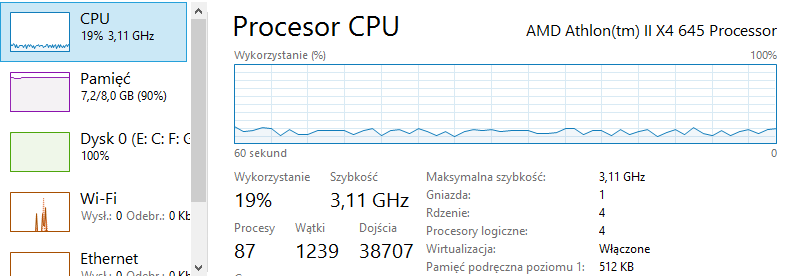
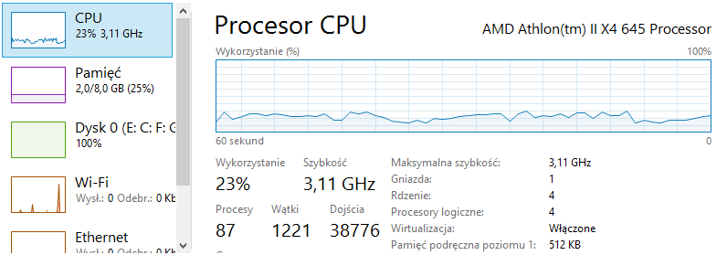

#### Zadanie 2a. Zaimportować, do systemów baz danych:
 Zaimportowana baza reddita - [RC_2015_01](https://www.reddit.com/r/datasets/comments/3bxlg7/i_have_every_publicly_available_reddit_comment).
#### Zadanie 2b. Zliczyć liczbę zaimportowanych rekordów.
Zliczenie ilości rekordow wykonałem za pomocą poleceń:  
**MongoDB** -  `db.reddit.count()`  
Czas: _0,00 min_, Wynik: _53851542_  
**PostgreSQL** - `select count(*) from import.RC_2015_01;`  
Czas: _40,13 min_, Wynik: _53851542_  
Do importu bazy w PostgreSQL wykorzystalem zewnetrzny program [Pgfutter](https://github.com/lukasmartinelli/pgfutter)

#### Zadanie 2c. Policzyć kilka prostych agregacji na zaimportowanych danych. Wyniki przedstawić graficznie lub w postaci tabelki.
| Opis | Wynik | MongoDB | PostgreSQL |
|------------|------|------|----------|
| Zliczenie rekordow | 53851342 | 0:00:00 | 0:42:13 |
| Zliczenie wpisow z 'score' powyzej 1000 | 20479 | 0:21:36 | 0:44:01 |
| Wyszukanie autora z najwiekszym 'score' | [wynik](mongo1.png) | 0:37:44 | 1:07:11 |
| Zliczenie wszystkich postwow tego autora | 34 | 0:19:17 | 0:35:55 |
| Wyswietlenie score pierwszych 10 wpisow tego autora | [wynik](mongo2.png) | 0:06:18 | 0:10:31 |

-----

#### Wykresy przedstawiajace prace podzespolow komputera podczas eksploratacji danych
MongoDB  

PostgreSQL  

-----

#### WNIOSKI  
1. Operacje w MongoDB zajmowaly prawie dwa razy mniej czasu. :clock1:
2. Import jsona do bazy PostgreSQL wymagal zewnetrznych narzedzi. :floppy_disk:
3. MongoDB wyswietla dane w bardziej przejrzysty sposob. :eyes:
4. PostgreSQL do poprawnego wyszukiwania wymagal zmiany kodowania znakow w PowerShellu :warning:
5. Wykresy :bar_chart:  
  **Procesor**: Obciazenie zblizone w obu przypadkach  
  **Pamiec**: MongoDB wykorzystuje 100%, PostgreSQL tylko 25%  
  **Dysk**: 100% obciazenia przy obu bazach  

-----

#### GeoJSONy

Dane potrzebne do tego zadania wygenerowalem za pomoca strony [geojson.io](http://geojson.io/)

Import wykonany za pomoca polecenia: `mongoimport -d city -c city miasta.geojson`  

Wyszukanie mojego rodzinnego miasta:  
`db.city.find({"name": "Olsztyn"})`  
`{ "_id" : 763166, "name" : "Olsztyn", "country" : "PL", "loc" : { "type" : "Point", "coordinates" : [ 20.49416, 53.779949 ] } }`  

[geojson1](1.geojson)

Wyszukanie miejscowoci w odleglosci 10km wokol Olsztyna:  
`db.city.find({loc: {$near: {$geometry: {type: "Point", coordinates: [ 20.49416, 53.779949 ]}, $maxDistance: 10000}}},{_id:0, name: 1}).skip(1)`  
Wynik:   
`{ "_id" : 766303, "name" : "Likusy", "country" : "PL", "loc" : { "type" : "Point", "coordinates" : [ 20.4345, 53.795681
] } }`  
``{ "_id" : 772768, "name" : "Dywity", "country" : "PL", "loc" : { "type" : "Point", "coordinates" : [ 20.47817, 53.837589
 ] } }`    
`{ "_id" : 6619358, "name" : "Powiat olsztyński", "country" : "PL", "loc" : { "type" : "Point", "coordinates" : [ 20.5664
1, 53.729221 ] } }``  

[geojson2](2.geojson)  

Polygon:  
 `> db.city.find( { loc: {$geoWithin : { $geometry: {type : "Polygon", coordinates: [ [[20.387,53.818], [22.566,51.0], [23.387,51.818], [20.387,53.818]] ]}}}},{_id:0, name:1} ).limit(5)`  
Wynik:  
`{ "name" : "Stoczek Lukowski" }
{ "name" : "Latowicz" }
{ "name" : "Chorzele" }
{ "name" : "Chorzele" }
{ "name" : "Wielbark" }`  

[geojson3](3.geojson)
